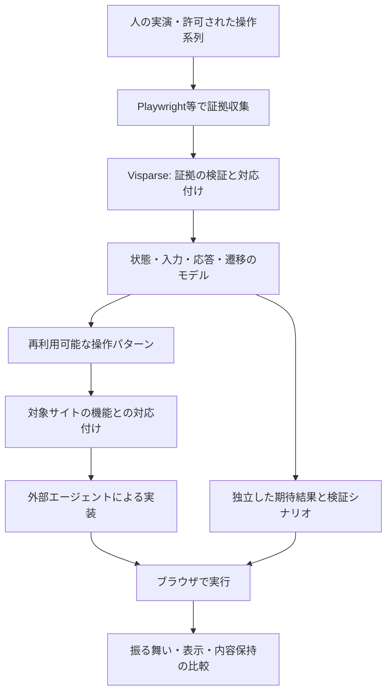

# UX解析・デコンパイルと別サイトへの移植：初期調査

調査日：2026-09-08。対象コード：`72e7facb08b157e4cead3db15b019208b996ea4d`。
論文、著者公開リポジトリ、公式ドキュメントを確認した文献調査。各ツールのインストール、ベンチマークの追試、実サイトの操作収集は今回実施していない。以下の設計・優先順位は調査からの提案で、実装済み仕様ではない。

**結論：証拠収集には既存ブラウザツールを使い、Visparseでは「観測された振る舞い → 証拠付きの状態・操作モデル → 再利用可能な操作パターン」の変換を担うのが有望。** 調査した範囲では、既存サイトのUXを解析して任意の別サイトに意味を保って移植する工程全体を、そのまま任せられる完成品は確認できなかった。ただし、収集・状態探索・再構築評価・テスト移植には直接参考になる研究と実装がある。

**何をデコンパイルするか**

最初の対象は、ユーザーから観測できる操作と応答の仕様とする。ソースコードやバックエンドの原実装を取り戻すこと、利用者の満足度を観測なしに推定することとは区別する。

| 層 | 取り出すもの | 別サイトに渡すときの扱い |
| --- | --- | --- |
| 実行証拠 | 操作前後の画像、DOM/AX、操作対象、入力、時刻、観測された結果 | 原本を保持し、具体的な主張から参照する |
| 振る舞いのモデル | 状態、イベント、条件、応答、遷移、取消・復帰、保存 | 未観測分岐を不明として明示する |
| 再利用可能なパターン | 検索→絞込→詳細、編集→保存/取消、段階入力→確認など | ドメイン固有の値と共通の操作規則を分離する |
| 対象サイトへの対応付け | 対象機能・データ・要素とパターンの役割の対応 | 対象サイトの内容と業務上の制約を維持する |

同じ見た目の画面でも、未保存変更や選択値が違えば次の応答は変わる。逆に時計や広告の変化は、操作上の新状態とは限らない。画像差分やDOMハッシュだけで状態を確定する設計は避けたい。

**直接参考になる研究**

| 研究 | 確認できた内容 | Visparseへの示唆・限界 |
| --- | --- | --- |
| [Interaction2Code / ASE 2025](https://github.com/WebPAI/Interaction2Code) | 操作前後の画像と対応情報から対話的Webページを生成・評価。現行READMEは127ページ・374操作。操作対象の欠落、無反応、誤った対象、部分実装などを分類 | 操作対象と変化した領域の明示が重要。ページ全体の見た目と操作部分を別評価する。別ドメインへのUX移植を実証した研究ではない |
| [IWR-Bench / ICLR 2026](https://proceedings.iclr.cc/paper_files/paper/2026/hash/55bfedfd31489e5ae83c9ce8eec7b0e1-Abstract-Conference.html) | 動画と静的素材から再構築。100サイト、113タスク、1,001操作。機能と見た目を分けて評価 | 操作系列を実行して評価する設計が今回の目的に近い。論文中の最高モデルは機能24.39、視覚64.25という差があるが、これは報告時点の条件内の値で、現在のモデル全体の上限ではない |
| [GUI Test Migration via Abstraction and Concretization / MACdroid, TOSEM 2025](https://arxiv.org/abs/2409.05028v2) | 元アプリのテストから共通の機能ロジックを抽象化し、対象アプリのイベントと検証条件へ具体化する | 今回の「別サイトへ移す」に特に近い考え方。Androidのテスト移植の成果であり、WebのUX生成への適用は未検証 |
| [Vision2Web / 2026-03 preprint](https://arxiv.org/html/2603.26648v1) | 静的画面、対話的フロントエンド、フルスタックを分け、構造化したワークフローと検証地点で評価 | 機能と見た目を独立に評価できる。元サイトの解析を完全自動化する研究ではない。エージェント判定にも誤りがあり、正解判定の根拠が必要 |
| [Rendering-in-the-Loop / RILA, 2026-09-02 preprint](https://arxiv.org/abs/2609.02088v1) | 参照操作を生成ページ上で再実行し、その結果を修正ループに利用 | 生成側の将来ヒント。Visparseは不一致を証拠付きで返す契約を用意し、コード修正は外部に置ける。公開直後の論文であり、本調査では追試していない |
| [WebExplor / 2021](https://arxiv.org/abs/2103.06018) | 好奇心に基づく強化学習と、探索中に構築するオートマトンでWeb操作を探索 | 未観測の分岐を見つける研究として参考。探索を賢くすることと、移植可能なUX仕様を得ることは別課題 |
| [Automated Web GUI Testingの比較研究 / 2026-06 preprint](https://arxiv.org/html/2606.16650v1) | 探索戦略と状態抽象化の組み合わせを比較。全評価軸で一律に強い方式はなく、LLMには簡潔な機能単位の履歴が有効と報告 | 巨大なDOM履歴をそのまま渡すより、原本へ参照できる操作履歴要約を検討する。対象アプリ・実験条件に依存する結果である |

Interaction2Codeは古い検索結果の97ページ・213操作と、現行READMEの数が異なるため、実験時にはデータ版を固定する。IWR-Benchの[公開実装](https://github.com/SIGMME/IWR-Bench)にはデータ取得・生成・評価手順がある。参照操作列と操作後画像を正解として使用する。READMEの成績表は2025-09-24更新と記されており、2026年時点の最新ランキングとは扱わない。

**使える既存プロジェクト・仕様**

| 候補 | 役割 | 採用判断 |
| --- | --- | --- |
| [Playwright Trace Viewer](https://playwright.dev/docs/trace-viewer) / [Tracing API](https://playwright.dev/docs/api/class-tracing) | 操作、前後のDOMスナップショット、画像、ネットワークの記録 | 最初の収集アダプター候補。Visparseは自前の安定した証拠形式へ変換する。`context.tracing`単体はテストassertionを記録しないため、期待結果は別途持つ |
| [rrweb](https://github.com/rrweb-io/rrweb) / [Record & Replay](https://rrweb.com/product/record-and-replay) | DOMと操作イベントの記録・再生、独自イベントの付加 | 人が実演した系列の保存に有用。ただし記録された再生ができても、未記録の入力に応答する別アプリが得られたとはいえない |
| [Crawljax](https://github.com/crawljax/crawljax) | イベント駆動でWebを探索し、DOM状態と遷移のグラフを構築 | 状態探索の先行実装。初期版の依存に直結させず、状態の同一性・探索打切り・カバレッジ設計を参考にする |
| [BrowserGym](https://github.com/ServiceNow/BrowserGym) / [WebArena](https://github.com/web-arena-x/webarena) | ブラウザ操作環境、複数ベンチマーク、初期化とタスク評価 | 後の評価用環境候補。エージェントが既存サイトで仕事を完了できる評価と、元UXを移植できた評価を混同しない |
| [browser-use](https://github.com/browser-use/browser-use) | エージェントによる操作・状態取得の実行環境 | ホスト側の候補。Visparseに同じブラウザエージェントを内蔵する必要はない |
| [CraftDroid](https://github.com/seal-hub/CraftDroid) | 意味的な対応付けによるアプリ間のテスト移植 | 役割対応とテストの期待結果を引き継ぐ考え方が参考。Android向けであり、Webにそのまま組み込む候補ではない |
| [W3C SCXML](https://www.w3.org/TR/scxml/) | 階層・並行状態などを持つ状態機械の意味論 | 状態モデルの参照仕様。観測できない初期値・条件・副作用を埋めて実行可能にしてしまわない。初期からXMLや全仕様の採用は必要ない |
| [XState Graph & Paths](https://stately.ai/docs/graph) | 定義済み状態モデルから実行パスやテストを生成 | 外部の実行・検証アダプター候補。既存サイトからモデルを自動発見する機能とは別。カバレッジは定義済みモデルに対する値 |
| [CTT / W3C Task Models](https://www.w3.org/TR/task-models/) | 利用者の目的、下位タスク、順序・選択・中断の表現 | DOMから離れた操作パターンの抽象化に参考。W3C RecommendationではなくWorking Group Noteであり、規格の成熟度を混同しない |
| [WAI-ARIA APG: Modal Dialog](https://www.w3.org/WAI/ARIA/apg/patterns/dialog-modal/) | フォーカス移動、Tab循環、Escape、終了後の復帰などの操作パターン | 検査項目の候補。推奨仕様を元サイトで観測した挙動として書き込まない |

rrwebの[Canvas記録](https://rrweb.com/docs/recipes/canvas)は既定で有効ではなく、専用設定などが必要。Kirkaのようなゲームを扱う場合は、DOMのロビーUIとCanvas/WebGL内の描画・ゲーム挙動を別の証拠範囲として管理する。ゲーム本体の意味をDOM記録だけから復元できるとは扱わない。

**Visparseの現状との差分**

現行の[基本レコード](../src/visparse/model.py)には`interactions`があるが、主に`kind`、`details`オブジェクト、任意の`source_id`、時刻文字列を検証する。前状態・後状態・操作対象・条件・期待結果を共通の型として扱う契約にはなっていない。

[Design DNA](../src/visparse/dna.py)には`viewport/state/subject`のスコープと`motion.preference`がある。しかし、`state`の名前を持つことと、状態間の遷移・到達条件を解析することは異なる。

[inspection](inspection.md)は外部の実行証拠を受け取れる。一方、[既存collector](design-workflow.md)は静的収集を対象とし、リンク追跡や状態変更操作を実行しない。新機能はこの既定の意味を変えず、明示された操作系列を扱う別の入口が適切。

**提案する中間表現**

既存のDesign DNAへすべてを押し込まず、証拠基盤を共有する独立したバージョン付きの操作モデルを検討する。名称は仮に`interaction-profile`とし、確定仕様にはしない。

| 項目 | 最低限必要な情報 |
| --- | --- |
| 収集単位 | セッション、初期化条件、viewport、入力方式、時刻基準、証拠ID、収集上限・欠落 |
| 操作対象 | 収集内の要素ID、DOM/AX/画像の参照、意味的役割。CSS selectorは原サイト用の実行手掛かりに限定 |
| 状態 | 観測できた選択・表示・入力・フォーカスなどの条件と、その証拠。未観測状態は別扱い |
| 遷移 | 前状態、入力、操作対象、条件、観測した応答と後状態、失敗・無変化・タイムアウト |
| 時間 | 入力受理、フィードバック開始、安定状態までの観測時間、環境と測定方法 |
| 継続性 | 戻る、取消、やり直し、再読込、別セッションで保たれた情報と範囲 |
| 解釈 | 状態統合、役割推定、共通パターン、推定条件に対する根拠と不確実性 |
| 対象への対応 | 元の役割と対象の役割、保存する振る舞い、対象の制約、対応不能・不明の理由 |

操作Aの後に変化Bを観測しても、Aだけが原因と直ちに断定しない。自動更新・アニメーション・通信と重なる可能性を記録し、必要に応じて再実行する。実測された一回の待ち時間と、再実装の目標時間も分離する。

状態モデルは最初から全体を一つの巨大なグラフにしない。たとえばダイアログの開閉とフィルター選択を別の局所状態として表し、その依存関係を記録する。状態を統合する判定もモデルによる解釈であれば、観測とは別に残す。

**別サイトへの移植で守ること**

最近の見た目移植では、要素が残っていても元の大きさや重要度が失われた。UX移植では同様に、操作の名前が残っていても、取消・保存・戻る・失敗時の回復が消える可能性がある。対象の操作一覧と守るべき条件を移植前に記録する必要がある。

たとえば、元の「レシピをお気に入りへ保存」から、観測された範囲で「項目を選択→保存状態を表示→再読込でも保持→解除可能」というパターンを抽出する。対象サイトに同等の保存機能があれば、その対象データと操作へ対応付ける。保存対象の種類や永続化の範囲が違えば差分を明示する。

対して「対戦部屋へ参加」を「問い合わせ送信」へ、ボタン形状だけを理由に対応させることはできない。目標・必要データ・取消可能性・結果が異なるため、共通化できるのは入力検証や待機表示などの一部分に限られる可能性がある。

「同等タスクを達成できればよい」と「途中の操作順・フィードバックまで保持する」は違う移植方針である。MACdroid等のテスト移植の成功だけでは後者を保証しない。どちらを評価するかを利用者の意図として入力に含める。

**最初に行う実験案**

1. 証拠の正解を持つ小さなローカルサイトを用意する。タブ、ダイアログ、フォームの入力不備→修正、保存→再読込→解除、フィルター、遅延→成功/失敗→再試行を含める。期待結果は解析器が生成したものだけに依存させない。
2. 最初は人または固定スクリプトが明示した操作系列を収集する。自動探索の良し悪しを解析の良し悪しと混ぜない。原サイトからコードを読む条件は別実験にする。
3. 同じ系列で「画像のみ」「動画と入力ログ」「画像・ログ・DOM/AX」を比較する。主要な違い以外のプロンプト・生成条件を固定し、複数回でばらつきを記録する。
4. Visparseが証拠付きの操作モデルと、人が読める導出資料を出す。欠落、未観測、観測された無変化、実行失敗を区別する。
5. 別内容・別外観で同等の機能を持つ対象サイトへ、解析結果と対象側の契約だけを渡す。生成側には元画像・動画・原サイトコードを渡さない。対象の保持対象を事前に固定する。
6. 記録した経路に加え、元サイトで別途確認しておいた保留評価経路も実行する。前者の成功と未提示経路への一般化を別に報告する。既存状態が影響しないよう各試行の初期条件を固定する。

既存のKirka/Kraft生成サンプルも収集実験の題材には使えるが、その操作は以前の生成器が推定して実装したもの。そこから収集しても、実在するKirka/KraftのUXを解析できた証拠にはならない。実サイトへ進む段階では、実サイト自身の操作証拠を別途取得する。

**評価軸**

| 評価 | 確かめること |
| --- | --- |
| 証拠の品質 | どの操作・状態をどの範囲で収集したか。DOMと画像の対応、時刻、取りこぼし |
| 解析の正確さ | 正解付き状態・遷移・結果を抽出できるか。根拠のない分岐や条件を追加していないか |
| 未観測の扱い | 観測範囲外を不明にできるか。未知を失敗や不存在に変えていないか |
| 移植の機能 | 選択、取消、エラー回復、保存範囲、対象データとの結合が期待通りか |
| 操作体験 | フォーカス、キーボード、フィードバック、待機、順序が選択した移植方針を満たすか |
| 内容保持 | 対象側の既存タスク・項目・操作が失われていないか |
| 外観 | 指定した見た目を各状態で保つか。機能スコアとは別に扱う |

カバレッジの分母は、宣言した試験シナリオまたは既知のモデルとする。未知の実サイト全体に対する「全状態を網羅」は主張しない。エージェントのクリック失敗・検証失敗と、生成物の仕様不一致も分離する。

**実装へ進む場合の優先順位**

最初は「明示操作系列の証拠契約」「状態・遷移の解析と未知の扱い」「証拠を保った出力」「正解付き評価」の4点に絞る。その後に、対象サイトへの役割対応と保持契約、自動探索、動画しかない対象、Canvas/WebGL内の挙動へ広げる。

Playwrightの収集、Crawljaxの探索、XStateの実行意味論をすべてVisparseに内蔵する必要はない。既存の外部収集・プロバイダー非依存・証拠と推定の分離を保つ。生成側の修正ループは将来の統合ヒントとして扱う。

初期調査に続き、2026-09-08に以下のIssueを登録した。実装・PR作成はまだ行っていない。最初の成果物は、状態・遷移を持つ小さな合成fixtureと独立した期待結果とする。

| Issue | 範囲 |
| --- | --- |
| [#39 全体方針・調査根拠・段階計画](https://github.com/takahirox/visparse/issues/39) | 初期マイルストーンを追跡し、後続研究と区別する |
| [#40 操作系列の証拠契約](https://github.com/takahirox/visparse/issues/40) | バージョン付きの入力と検証 |
| [#41 明示操作のブラウザ収集](https://github.com/takahirox/visparse/issues/41) | 元の静的収集を維持する別の入口 |
| [#42 状態・遷移・応答の解析](https://github.com/takahirox/visparse/issues/42) | 証拠と推定、未知の分離 |
| [#43 操作仕様・パターンの出力](https://github.com/takahirox/visparse/issues/43) | 証拠を保った生成向け資料 |
| [#44 独立した正解を使う評価](https://github.com/takahirox/visparse/issues/44) | 初期fixtureから移植実験までの評価 |
| [#45 対象サイトへの役割対応](https://github.com/takahirox/visparse/issues/45) | 対象の機能・データ・制約の保持 |

証拠契約と評価fixtureから着手し、収集・解析・出力を経て役割対応を実装する。#44の最初のfixture作成は#45を待たずに進め、最後の移植評価で統合するため、相互参照は実装の循環依存ではない。
